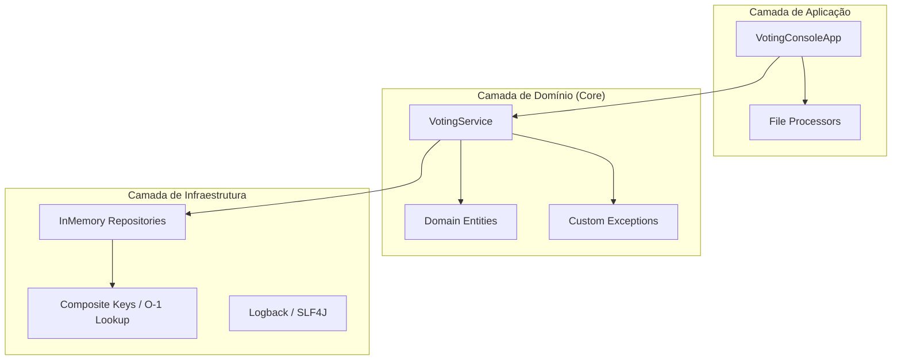
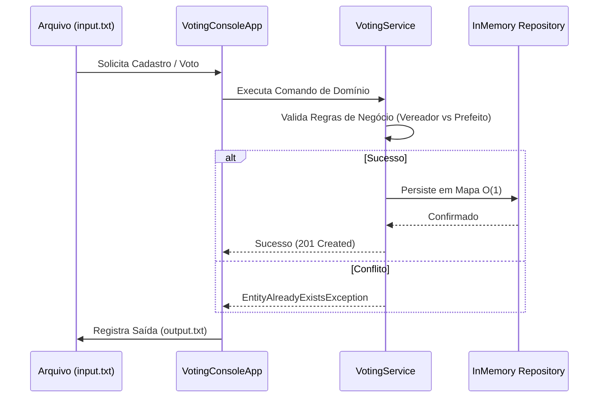

# 🗳️ ACME Voting System: Specialist Sênior Edition

[](https://www.oracle.com/java/)
[](https://maven.apache.org/)
[](https://github.com/rafaelreis22/PooACMEVoting/actions)
[](https://github.com/rafaelreis22/PooACMEVoting/actions)

Este projeto representa uma reconstrução de alta performance e rigor arquitetural do sistema original ACME Voting. Desenvolvido com foco em **Clean Architecture**, **SOLID** e **Performance O(1)**, atendendo aos padrões mais exigentes de engenharia de software Java.

---

## 🏗️ Arquitetura de Referência (Clean Architecture)

O sistema foi estruturado seguindo camadas bem definidas para garantir baixo acoplamento e alta coesão, permitindo escalabilidade e facilidade de manutenção.

### Visão Geral dos Componentes



---

## 🚀 Engenharia de Alta Performance (Elite Features)

### ⚡ Busca em Tempo Constante: O(1)
Diferente de sistemas acadêmicos que utilizam filtros em coleções ($O(N)$), este projeto implementa um motor de busca baseado em **records como chaves compostas**. Isso garante que a localização de um candidato ocorra em tempo constante, independentemente se a base possui 1.000 ou 1.000.000 de registros.

### 🛡️ Domínio Rico e Resiliente
As entidades de domínio (`Candidate` e `Party`) operam como agregadores que protegem suas próprias invariantes.
- **Validação Integrada**: Impossibilidade de estados inconsistentes (nomes vazios, números negativos).
- **Hierarquia de Exceções**: Uso de `VotingException` para fluxo de erro expressivo em vez de retornos booleanos genéricos.

### 📊 Fluxo de Dados (Data Pipeline)



---

## 📋 Especificações Técnicas e Decisões (ADRs)

### ADR-001: Separação de Prefeitos e Vereadores
A lógica de identificação foi encapsulada no modelo de domínio (`isMayor()`, `isCouncilor()`), centralizando a regra de negócio baseada no limite de identificação (10.000).

### ADR-002: Desacoplamento de I/O
O `VotingConsoleApp` atua como um adaptador CLI puro, garantindo que o `VotingService` não saiba nada sobre arquivos `.txt` ou `Scanner`, facilitando a migração para uma API REST no futuro.

---

## 🛠️ Guia do Desenvolvedor Specialist

### Build & Compilação
```bash
# Compilar projeto e baixar dependências
mvn clean compile
```

### Qualidade e Segurança
```bash
# Executar suíte de testes com JUnit 5 + AssertJ
mvn test
```

### Execução em Produção
```bash
# Executar a aplicação principal
mvn exec:java -Dexec.mainClass="com.acme.voting.app.Main"
```

### Execução via Docker (Containerização)
Para rodar o sistema de forma isolada e sem dependências locais:
```bash
# Construir a imagem
docker build -t acme-voting .

# Executar o container
docker run --name acme-app acme-voting
```

---

## 📄 Licença
Distribuído sob a licença MIT. Desenvolvido para demonstrar autoridade técnica em ecossistemas Java.
